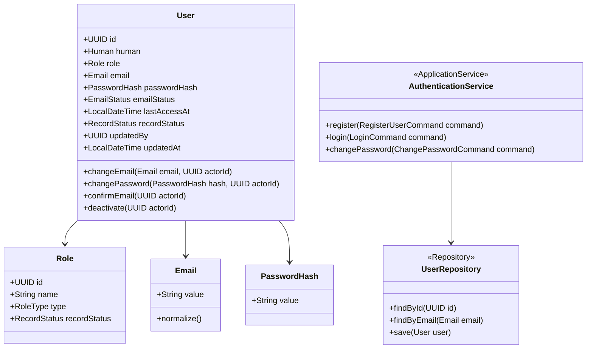
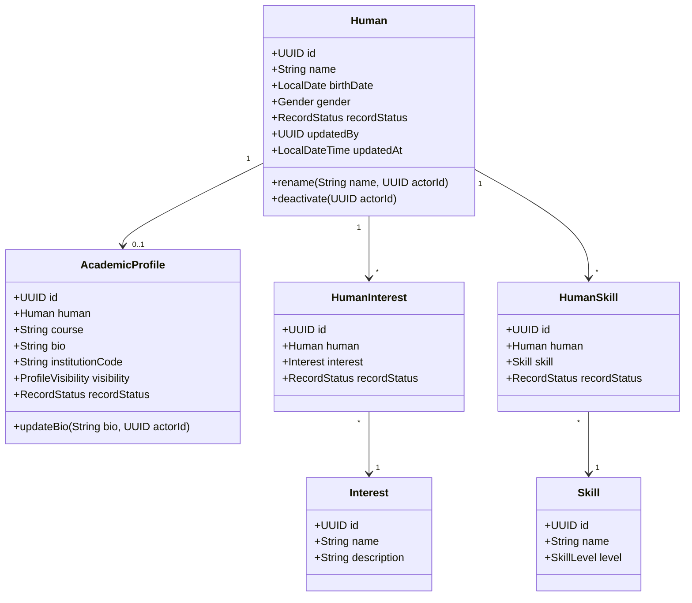
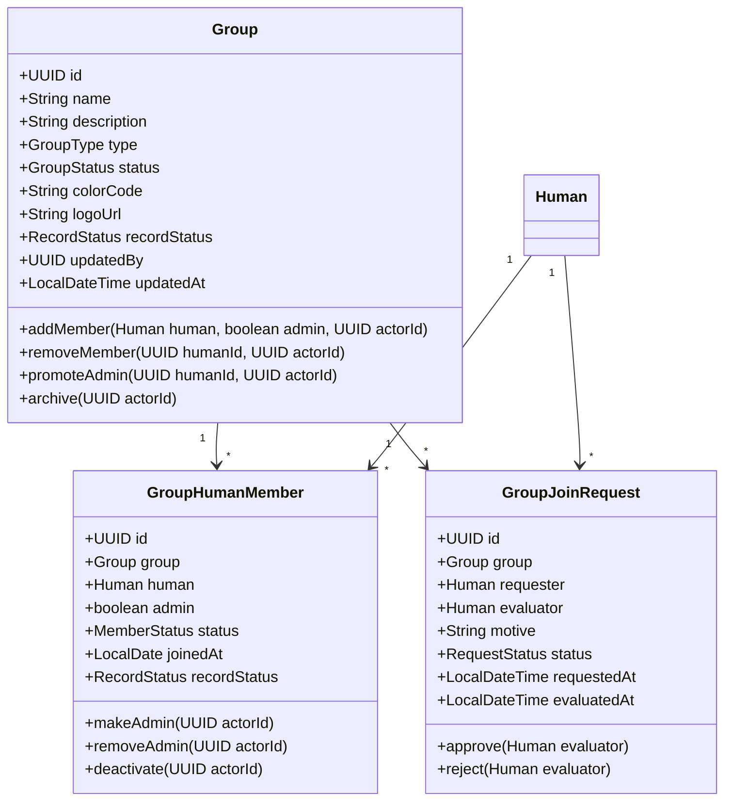
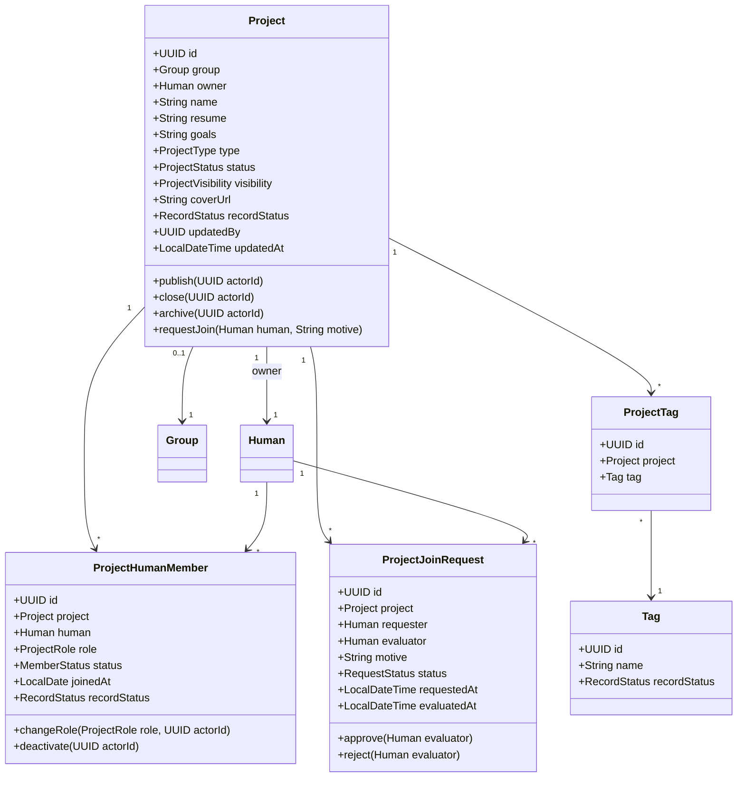
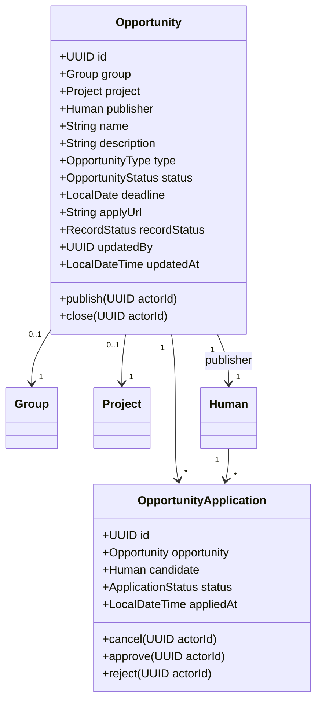
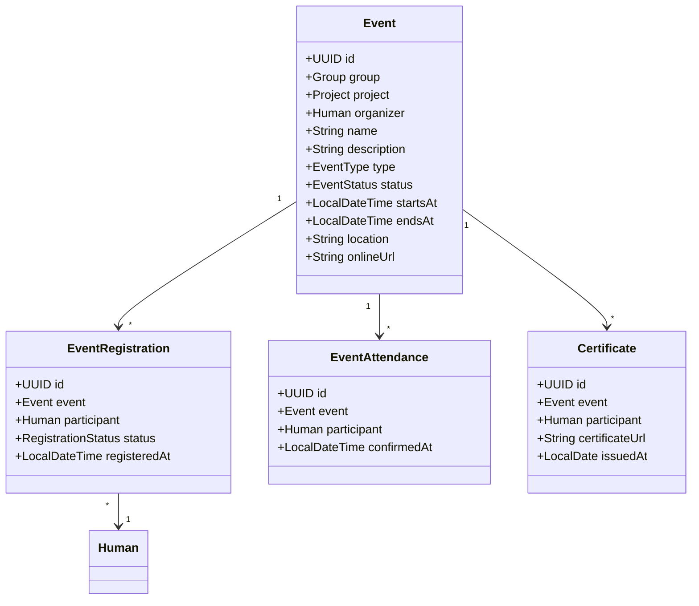
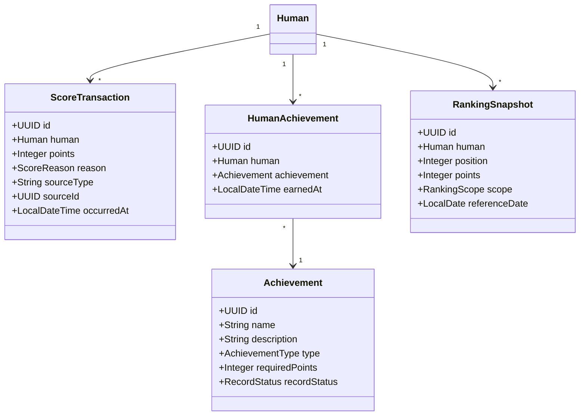
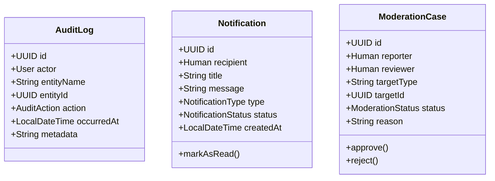

# Class Model

Este documento define o modelo de classes alvo do NEXUS HUB, pensado para Java, orientacao a objetos e evolucao arquitetural do backend.

Os nomes de classes, metodos e atributos devem ficar em ingles. As explicacoes e regras podem ficar em portugues.

## 1. Principios OO

O modelo de classes nao deve ser uma copia mecanica do banco.

Regras:

- Entidades representam identidade e ciclo de vida.
- Value Objects representam conceitos sem identidade propria.
- Agregados protegem invariantes importantes.
- Services coordenam casos de uso quando a regra nao pertence naturalmente a uma entidade.
- Repositories persistem agregados.
- DTOs continuam separados das entidades.
- Controllers nao conhecem detalhes internos do dominio.

## 2. Packages Alvo

Estrutura recomendada para uma refatoracao futura:

```text
br.ufpb.dsc.nexushub
├── identity
│   ├── domain
│   ├── application
│   └── infrastructure
├── people
│   ├── domain
│   ├── application
│   └── infrastructure
├── groups
│   ├── domain
│   ├── application
│   └── infrastructure
├── projects
│   ├── domain
│   ├── application
│   └── infrastructure
├── opportunities
│   ├── domain
│   ├── application
│   └── infrastructure
├── events
│   ├── domain
│   ├── application
│   └── infrastructure
├── gamification
│   ├── domain
│   ├── application
│   └── infrastructure
└── administration
    ├── domain
    ├── application
    └── infrastructure
```

No estado atual do projeto, esses pacotes ainda podem viver dentro dos modulos Maven `model` e `controller`. A separacao acima e o alvo conceitual.

## 3. Estereotipos

Use estes estereotipos:

- `Entity`: objeto com identidade persistente.
- `ValueObject`: objeto imutavel, sem identidade propria.
- `AggregateRoot`: entidade raiz de um agregado.
- `DomainService`: regra de dominio que envolve varias entidades.
- `ApplicationService`: orquestracao de caso de uso.
- `Repository`: porta de persistencia.
- `DTO`: contrato de entrada ou saida.

## 4. Identity

Responsabilidade:

- Conta de acesso.
- Papel/permissao.
- Autenticacao.
- Politica de senha.
- Auditoria basica por usuario autenticado.

Classes principais:

- `User`
- `Role`
- `Email`
- `PasswordHash`
- `AuthenticationService`
- `UserRepository`



Decisao importante:

- `User` nao representa a pessoa. Ele representa a credencial/conta.
- A pessoa fica em `Human`.
- Na criacao inicial, `User.idupdatedby = User.id`.

## 5. People

Responsabilidade:

- Pessoa fisica base.
- Perfil academico.
- Interesses e habilidades.

Classes principais:

- `Human`
- `AcademicProfile`
- `Interest`
- `Skill`
- `HumanInterest`
- `HumanSkill`



Regra:

- Atributo multivalorado nao fica como lista textual dentro de `Human`.
- Interesses e habilidades usam tabelas/classes de relacao.

## 6. Groups

Responsabilidade:

- Grupos academicos.
- Membros de grupo.
- Administradores de grupo.
- Solicitacoes de entrada em grupos restritos.

Classes principais:

- `Group`
- `GroupHumanMember`
- `GroupJoinRequest`



Regra:

- A tabela/classe de relacao entre humano e grupo e `GroupHumanMember`.
- O campo `admin` pertence a essa relacao, nao a `Human` nem a `Group`.

## 7. Projects

Responsabilidade:

- Projetos academicos.
- Membros de projeto.
- Solicitacoes de entrada.
- Tags.
- Atividades ou entregas futuras.

Classes principais:

- `Project`
- `ProjectHumanMember`
- `ProjectJoinRequest`
- `Tag`
- `ProjectTag`
- `ProjectActivity`



Regras:

- Autor/responsavel do projeto e FK para `Human`.
- Membros do projeto ficam em `ProjectHumanMember`.
- Tags sao multivaloradas, logo usam `Tag` + `ProjectTag`.
- Solicitacao de entrada sempre aponta para projeto e humano por ID.

## 8. Opportunities

Responsabilidade:

- Oportunidades gerais.
- Vagas vinculadas a grupo/projeto.
- Candidaturas.

Classes principais:

- `Opportunity`
- `OpportunityApplication`



## 9. Events

Responsabilidade:

- Eventos academicos.
- Inscricoes.
- Presenca.
- Certificados.

Classes principais:

- `Event`
- `EventRegistration`
- `EventAttendance`
- `Certificate`



## 10. Gamification

Responsabilidade:

- Pontuacao como extrato.
- Conquistas.
- Ranking.

Classes principais:

- `ScoreTransaction`
- `Achievement`
- `HumanAchievement`
- `RankingSnapshot`



Regra:

- Pontuacao nao deve ser apenas um campo acumulado em `Human`.
- O correto e um extrato (`ScoreTransaction`) e, se necessario, visoes/materializacoes para ranking.

## 11. Administration

Responsabilidade:

- Auditoria detalhada opcional.
- Notificacoes.
- Moderacao.

Classes principais:

- `AuditLog`
- `Notification`
- `ModerationCase`



## 12. Enums Recomendados

```text
RecordStatus: ACTIVE, INACTIVE
EmailStatus: PENDING, CONFIRMED
Gender: MALE, FEMALE, OTHER, UNINFORMED
RoleType: STUDENT, PROFESSOR, COORDINATOR, ADMIN, SYSADMIN
GroupType: INSTITUTIONAL, COMMUNITY, EXTERNAL
GroupStatus: ACTIVE, ARCHIVED
ProjectType: RESEARCH, EXTENSION, TEACHING, INTERNAL, EXTERNAL
ProjectStatus: DRAFT, PUBLISHED, CLOSED, ARCHIVED
ProjectVisibility: PRIVATE, PUBLIC, PUBLIC_OPEN
MemberStatus: ACTIVE, INACTIVE, BLOCKED
RequestStatus: PENDING, APPROVED, REJECTED, CANCELED
OpportunityType: SCHOLARSHIP, INTERNSHIP, MONITORING, VOLUNTEERING, CALL
OpportunityStatus: OPEN, CLOSED, PAUSED, FILLED
ApplicationStatus: SUBMITTED, APPROVED, REJECTED, CANCELED
```

## 13. Agregados Recomendados

| Aggregate Root | Entidades internas | Repositorio |
| --- | --- | --- |
| `User` | `Role` por referencia | `UserRepository` |
| `Human` | `AcademicProfile`, interesses e habilidades por relacao | `HumanRepository` |
| `Group` | `GroupHumanMember`, `GroupJoinRequest` | `GroupRepository` |
| `Project` | `ProjectHumanMember`, `ProjectJoinRequest`, `ProjectTag` | `ProjectRepository` |
| `Opportunity` | `OpportunityApplication` | `OpportunityRepository` |
| `Event` | `EventRegistration`, `EventAttendance`, `Certificate` | `EventRepository` |
| `Achievement` | `HumanAchievement` por relacao | `AchievementRepository` |

## 14. Regras Arquiteturais

- `Human` e a base de pessoa.
- `User` e conta de acesso.
- Relacionamentos entre entidades usam ID/FK.
- Tabelas/classes associativas carregam atributos da relacao.
- Nenhuma entidade deve guardar nome de outra entidade como relacionamento.
- Campos multivalorados devem virar classes/tabelas proprias.
- Auditoria enxuta usa `idupdatedby` e `updatedAt`.
- Historico completo usa `AuditLog`, se necessario.

